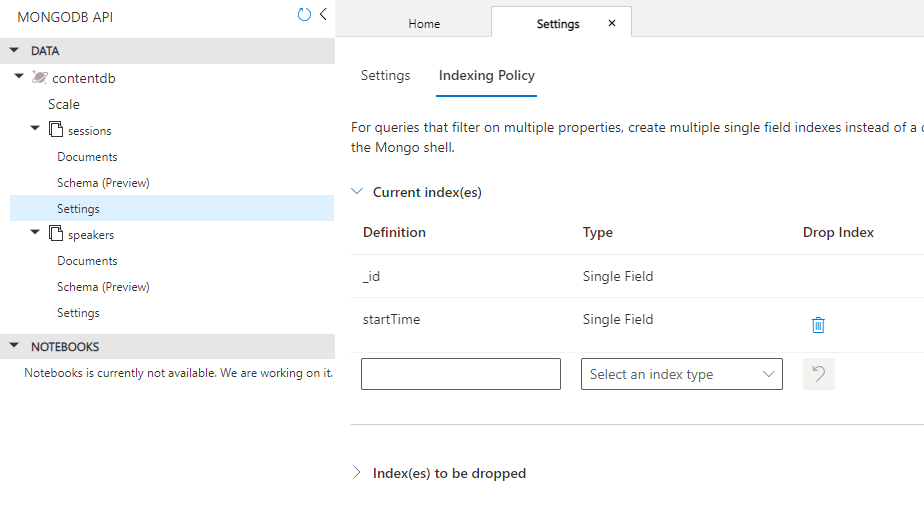

# Quickstart

Instead of initializing your own repositroy you can just fork this one to you
own github account.
This repo is a substract of the [Microsoft archived repo](https://github.com/microsoft/MCW-Cloud-native-applications).

# Solution architecture

Below is a diagram of the solution architecture you will build in this lab.

# Run locally

## Database

First of all, initialize your database by executing the following commands:

      docker container run --name mongo -p 27017:27017 -d mongo:4.0
      
      #Navigate to your content-init directory
      cd ./content-init

      sudo npm ci
      nodejs server.js

## Backend API

Make sure to get the proper Mongo DB connection string. To do that, get your IP Address where your mongo service is running:

      docker inspect mongo | grep IPAddress

And use the value returned in `IPAddress` to run your backend container

      cd ./content-api
      docker build -t content-api:1.0.0 .
      docker container run --name content-api -p 3001:3001 -e MONGODB_CONNECTION=mongodb://<IPAddress>:27017/contentdb  -d content-api:1.0.0

## Frontend

Make sure to get the proper backend api URL. To do that, get your IP Address where your mongo service is running:

      docker inspect content-api | grep IPAddress

And use the value returned in `IPAddress` to run your backend container

      cd ./content-web
      docker build -t content-web:1.0.0 .
      docker container run --name content-web -p 3000:3000 -e CONTENT_API_URL=http://<IPAddress>:3001 -d content-web:1.0.0

# Run in Azure

## Database

Azure Cosmos for Mongo DB enables us to use Mongo DB database as a service. In order to initialize the database,

1. Create an Azure Cosmos for Mongo DB
2. Create the database named `contentdb`
3. Execute the following commands (example with Powershell Core):

            cd ./content-init
            $env:MONGODB_CONNECTION="mongodb://<ACCOUNT-NAME>:<PRIMARY-KEY>@<ACCOUNT-NAME>.mongo.cosmos.azure.com:10255/contentdb?ssl=true&replicaSet=globaldb&retrywrites=false"
            npm start

4. When initialized, update the indexing policy of the automatically created `sessions` collection including the index on the field `startTime`, as illustrated in the image below. This property is used to sort sessions documents when fetched through the backend API.

## Container registry

Our docker images are made available to our Azure services through an Azure Container Registry. The following commands enable you to publish your images into this registry

      # Login with your account to Azure
      az login --tenant <tenant-id>

      # Get an access token to login to docker
      $TOKEN=$(az acr login --name <acrName> --expose-token --output tsv --query accessToken)
      docker login <acrName>.azurecr.io --username 00000000-0000-0000-0000-000000000000 --password $TOKEN

      # Build and publish your images
      cd ./content-api
      docker build -t <acrName>.azurecr.io/content/api:<tag> .
      docker push <acrName>.azurecr.io/content/api:<tag>

      cd ./content-web
      docker build -t <acrName>.azurecr.io/content/web:<tag> .
      docker push <acrName>.azurecr.io/content/web:<tag>

## Stage 1

The following schema illustrates the architecture of this stage. This shows a very basic Azure setup enabling us to quickly run our application on Azure.