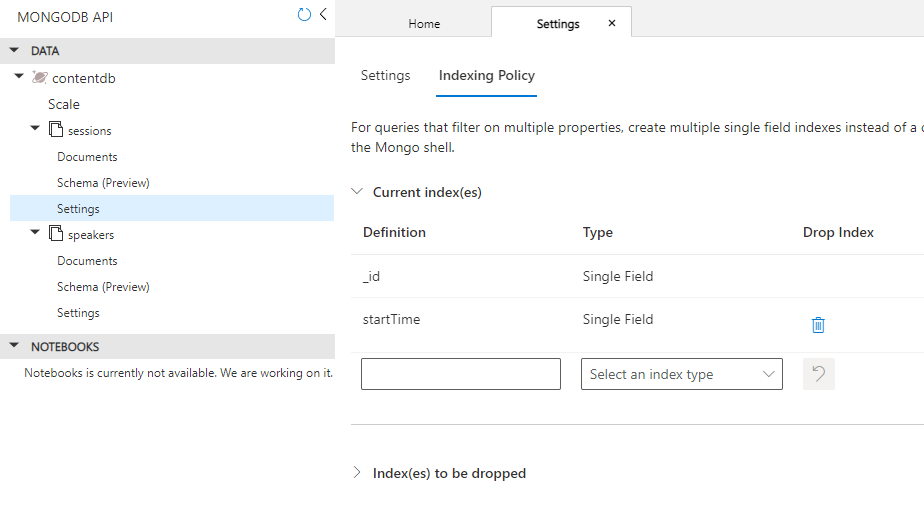

# Quickstart

Instead of initializing your own repositroy you can just fork this one to you
own github account.
This repo is a substract of the [Microsoft archived repo](https://github.com/microsoft/MCW-Cloud-native-applications).

# Solution architecture

Below is a diagram of the solution architecture you will build in this lab. It consists of a web application working with a backend API and relying on data stored in a Mongo DB. This application is made publicly available without any user authentication requirements.

# Run locally

## Develop with Dev Container

This repository now contains a ready-to-use Dev Container setup under `.devcontainer/`.

### Prerequisite

- Docker Desktop installed and running.
- VS Code extension: `Dev Containers`.

### Open in container

1. Open this repository in VS Code.
2. Run the command: `Dev Containers: Reopen in Container`.
3. Wait for the initial build and post-create dependency installation.

### Included tools

- Node.js via nvm (versions 10, 16, 20; default 16)
- Angular CLI 8.3.29
- MongoDB 4.0 service (docker-compose)
- Azure CLI + Bicep
- Docker CLI (host daemon access)

### Typical development commands inside the container

- Backend API: `npm --prefix content-api start`
- Data initialization: `node content-init/server.js`
- Frontend build (Angular): `npm --prefix content-web run build`
- Frontend server (Node/Express): `CONTENT_API_URL=http://localhost:3001 node content-web/app.js`
- Gateway (Envoy image build): `docker build -t content-gateway:1.0.0 ./content-gateway`

### Run web app with Node (recommended for `/api/*` routes)

If you want to keep the Node startup (instead of `ng serve`), use these steps.

1. Start backend API:

   npm --prefix content-api start

2. Seed data (if not already done):

   node content-init/server.js

3. Build Angular assets (one-time build):

   npm --prefix content-web run build

4. Start the web server with API target:

   node content-web/app.js

5. Open http://localhost:3000

Notes:

- In this mode, `/api/*` is handled by `content-web/app.js` and proxied to `CONTENT_API_URL`.
- For automatic front-end rebuilds while coding, run this in another terminal:

      npm --prefix content-web run build -- --watch

## Develop with local Node and MongoDB as Docker containers

### Database

First of all, initialize your database by executing the following commands:

      docker container run --name mongo -p 27017:27017 -d mongo:4.0

      #Navigate to your content-init directory
      cd ./content-init

      # Make sure you have node version 16 installed
      nvm use 16

      npm ci
      npm start

### Backend API

Make sure to get the proper Mongo DB connection string. To do that, get your IP Address where your mongo service is running:

      docker inspect mongo | grep IPAddress

And use the value returned in `IPAddress` to run your backend container

      cd ./content-api
      docker build -t content-api:1.0.0 .
      docker container run --name content-api -p 3001:3001 -e MONGODB_CONNECTION=mongodb://<IPAddress>:27017/contentdb  -d content-api:1.0.0

### Frontend

Make sure to get the proper backend api URL. To do that, get your IP Address where your mongo service is running:

      docker inspect content-api | grep IPAddress

And use the value returned in `IPAddress` to run your backend container

      cd ./content-web
      docker build -t content-web:1.0.0 .
      docker container run --name content-web -p 3000:3000 -e CONTENT_API_URL=http://<IPAddress>:3001 -d content-web:1.0.0

# Run in Azure

## Database

Azure Cosmos for Mongo DB enables us to use Mongo DB database as a service. In order to initialize the database,

1.  Create an Azure Cosmos for Mongo DB
2.  Create the database named `contentdb`
3.  Execute the following commands (example with Powershell Core):

            cd ./content-init
            $env:MONGODB_CONNECTION="mongodb://<ACCOUNT-NAME>:<PRIMARY-KEY>@<ACCOUNT-NAME>.mongo.cosmos.azure.com:10255/contentdb?ssl=true&replicaSet=globaldb&retrywrites=false"
            npm start

4.  When initialized, update the indexing policy of the automatically created `sessions` collection including the index on the field `startTime`, as illustrated in the image below. This property is used to sort sessions documents when fetched through the backend API.
    

## Container registry

Our docker images are made available to our Azure services through an Azure Container Registry. The following commands enable you to publish your images into this registry

      # Login with your account to Azure
      az login --tenant <tenant-id>

      # Get an access token to login to docker
      $TOKEN=$(az acr login --name <acrName> --expose-token --output tsv --query accessToken)
      docker login <acrName>.azurecr.io --username 00000000-0000-0000-0000-000000000000 --password $TOKEN

      # Build and publish your images
      cd ./content-api
      docker build -t <acrName>.azurecr.io/content/api:<tag> .
      docker push <acrName>.azurecr.io/content/api:<tag>

      cd ./content-web
      docker build -t <acrName>.azurecr.io/content/web:<tag> .
      docker push <acrName>.azurecr.io/content/web:<tag>

## Phase 1 - PoC

First of all, we start working on a proof of concept enabling us to validate our system in an Azure environment. During this phase, we will build and publish our docker images manually to the Azure Container Registry. Then, these images are deployed into Azure App Services.

The following schema illustrates the architecture we've built for this phase.

## Phase 2 - Code deployment automation

As our PoC was successful, the next step is to automatise our code deployment to remove manual activities and to prepare our environment to code changes and fast release.

